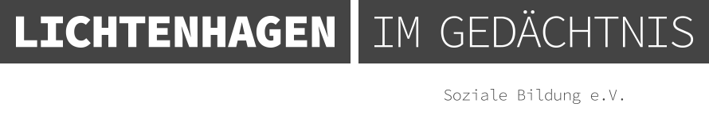

# Willkommen im Archiv!

## Struktur und Signatur
Die Signaturen jeder einzelnen Archivalie im Lichtenhagen Archiv folgen diesem Schema: II-B2-F4-3.

## Beispiel für eine Signatur
Das bedeuten die durch Bindestriche getrennten Felder:

* II - Zeitraum (der Erstellung oder des Drucks der Archivalie)
    * B2 - Herkunft (z.B. Verfasser_in)
        * F4 - Fundus (woher stammt das Original)
            * 3 - fortlaufende Nummer

## Bedeutung der einzelnen Signaturbereiche
### Zeitraum
* I - Vorgeschichte (18.03.1990 - 02.10.1990)
* II - Ereignisgeschichte (03.10.1990 - 31.08.1992)
* III - Nachgeschichte (01.09.1992 - 03.12.1993)

### Herkunft
* A - Kommune (Rostock)
* B - Land (MV)
* C - Bund
* D - International
* E - Varia
* 1 - staatliche Institutionen
* 2 - Zivilgesellschaft
* 3 - Printmedien
* 4 - Kultur, Bildung,Wirtschaft
* 5 - exteme Rechte

### Fundus
* F1 - Privatarchiv
* F2 - Unibiliothek Rostock - OZ, NNN
* F3 - Awiro e.V. (übernommen vom JAZ)
* F4 - Apabiz Berlin e.V.
* F5 - Stadtarchiv Rostock
* F6 - leer, in F3 übertragen
* F7 - Archiv der sozialen Bewegungen Hamburg (Vorrecherche
* F8 - Unibibliothek Rostock - Mecklenburger Morgenpost
